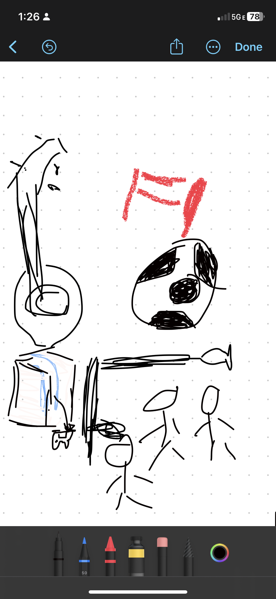

## About me 
***

> -  Hi my name is Varun and I am in 11th grade and this is my page. My github repository is: <a href="https://github.com/varunm532/varun" target="_blank">Github</a>!

## Errors I got and fixes 
***

> -  8/20/23: I fixed the code by typing a *#* on line 7 on Makefile so I can run *make* to run my local server. 
> -  *Make* didn't work because I accdently cloned the teacher repo to my student directory. To fix this: *ls teacher/* then *rm -rf teacher*. This removed the teacher repository 
> -  8/23/23: When *run all* in linux_shell.ipnb fail due to gem *mdless not found* typing in the vs terminal * gem install mdless * fixed the issue 

## Overview of Hacks, Study and Tangibles 
***

> - Plans, Lists, [Scrum Boards](https://clickup.com/blog/scrum-board/) help you to track key events, show progress and record time.  Effort is a big part of your class grade.  Show plans and time spent!
> - [Hacks(Todo)](https://levelup.gitconnected.com/six-ultimate-daily-hacks-for-every-programmer-60f5f10feae) enable you to stay in focus with key requirements of the class.  Each Hack will produce Tangibles.
>- Tangibles or [Tangible Artifacts](https://en.wikipedia.org/wiki/Artifact_(software_development)) are things you accumulate as a learner and coder. 
